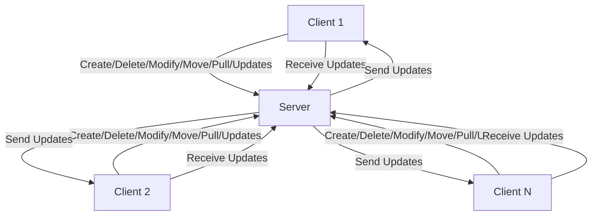

# Cloud Drive Client-Server Application

This project implements a client-server cloud drive using Python. It allows clients to upload, download, modify, delete, and move files on a remote server. 
The server manages multiple clients and synchronizes changes across all connected clients.

## Features
- **Create**: Add files or directories to the server.
- **Delete**: Remove files or directories from the server.
- **Modify**: Update the contents of a file on the server.
- **Move**: Move files or directories to a new location on the server.
- **Pull**: Retrieve the entire directory structure from the server.
- **Updates**: Get the latest changes from the server.

## Project Structure

### Server

The server code is responsible for handling multiple client connections and managing the file operations. It listens for incoming connections, processes client commands, and updates all clients with changes.

### Client

The client code monitors a local directory for changes and sends these changes to the server. It also pulls updates from the server to keep the local directory in sync.

## Server Code Explanation

- **Main Server Loop**: Listens for client connections and handles client commands.
- **Client Handling**: Processes various commands (create, delete, modify, move, pull, updates) from clients.
- **File Synchronization**: Sends file updates to all clients connected with the same identifier.

### Server Functions

- **`generate_identifier`**: Generates a unique identifier for each client.
- **`add_packet_to_update_dict`**: Adds changes to the dictionary for later synchronization.
- **`recv`**: Receives a specified amount of data from the client socket.
- **`send_file_to_client`**: Sends a file or directory to the client.
- **`send_empty_file_to_client`**: Indicates that all files have been sent.
- **`send_all_directory_to_client`**: Sends the entire directory structure to the client.
- **`create_command`**: Handles the creation of files or directories.
- **`delete_command`**: Handles the deletion of files or directories.
- **`modify_command`**: Handles the modification of files.
- **`move_command`**: Handles the movement of files or directories.
- **`handle_command`**: Processes the received command from the client.
- **`handle_all_clients`**: Iterates through all clients and handles their commands.
- **`remove_client_from_dict`**: Removes a client from the update dictionary when they disconnect.

## Client Code Explanation

- **Main Client Loop**: Connects to the server and handles file synchronization.
- **Watchdog Observer**: Monitors the local directory for changes and triggers the corresponding server commands.
- **Initial Synchronization**: Pulls the entire directory from the server on the first connection.
- **File Operations**: Handles creation, deletion, modification, and movement of files.

### Client Functions

- **`start_watchdog`**: Starts the watchdog observer to monitor local directory changes.
- **`stop_watchdog`**: Stops the watchdog observer.
- **`wait_observer`**: Waits for the observer to finish.
- **`pull_all_from_server`**: Retrieves the entire directory structure from the server.
- **`delete_recursive`**: Recursively deletes a directory and its contents.
- **`handle_command_from_server`**: Processes commands received from the server.
- **`pull_updates_from_server`**: Pulls updates from the server.
- **`push_file_to_server`**: Pushes a file or directory to the server.
- **`push_all_to_server`**: Pushes the entire directory structure to the server.
- **`first_connected_to_server`**: Handles the initial connection to the server and synchronization.
- **`get_identifier_from_server`**: Retrieves the identifier from the server.
- **`send_create_message`**: Sends a create message to the server.
- **`send_delete_message`**: Sends a delete message to the server.
- **`send_modify_message`**: Sends a modify message to the server.
- **`send_move_message`**: Sends a move message to the server.

## Usage

### Running the Server

To run the server, use the following command:
```bash
python server.py <port>
```
Replace `<port>` with the desired port number.

### Running the Client

To run the client, use the following command:
```bash
python client.py <server_ip> <port> <directory> [identifier]
```
Replace `<server_ip>` with the server's IP address, `<port>` with the port number, `<directory>` with the local directory to synchronize, and `[identifier]` with an optional identifier for synchronization.

## Diagram



In this diagram:
- Each client (A, C, D) can send various commands to the server (B).
- The server processes these commands and sends updates to all connected clients to keep them in sync.

## Dependencies

- `socket` for network communication.
- `os` for file operations.
- `sys` for command-line arguments.
- `watchdog` for monitoring file system changes.

## Installation

Install the required dependencies using pip:
```bash
pip install watchdog
```

